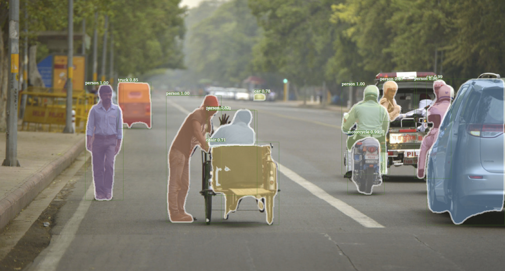

# Using Detectron

This document provides brief tutorials covering Detectron for inference and training on the COCO dataset.

- For general information about Detectron, please see [`README.md`](README.md).
- For installation instructions, please see [`INSTALL.md`](INSTALL.md).

## Inference with Pretrained Models

#### 1. Directory of Image Files
To run inference on a directory of image files (`demo/*.jpg` in this example), you can use the `infer_simple.py` tool. In this example, we're using an end-to-end trained Mask R-CNN model with a ResNet-101-FPN backbone from the model zoo:

```
python2 tools/infer_simple.py \
    --cfg configs/12_2017_baselines/e2e_mask_rcnn_R-101-FPN_2x.yaml \
    --output-dir /tmp/detectron-visualizations \
    --image-ext jpg \
    --wts https://s3-us-west-2.amazonaws.com/detectron/35861858/12_2017_baselines/e2e_mask_rcnn_R-101-FPN_2x.yaml.02_32_51.SgT4y1cO/output/train/coco_2014_train:coco_2014_valminusminival/generalized_rcnn/model_final.pkl \
    demo
```

Detectron should automatically download the model from the URL specified by the `--wts` argument. This tool will output visualizations of the detections in PDF format in the directory specified by `--output-dir`. Here's an example of the output you should expect to see (for copyright information about the demo images see [`demo/NOTICE`](demo/NOTICE)).

<div align="center">
  
  <p>Example Mask R-CNN output.</p>
</div>

**Notes:**

- When running inference on your own high-resolution images, Mask R-CNN may be slow simply because substantial time is spent upsampling the predicted masks to the original image resolution (this has not been optimized). You can diagnose this issue if the `misc_mask` time reported by `tools/infer_simple.py` is high (e.g., much more than 20-90ms). The solution is to first resize your images such that the short side is around 600-800px (the exact choice does not matter) and then run inference on the resized image.


#### 2. COCO Dataset
This example shows how to run an end-to-end trained Mask R-CNN model from the model zoo using a single GPU for inference. As configured, this will run inference on all images in `coco_2014_minival` (which must be properly installed).

```
python2 tools/test_net.py \
    --cfg configs/12_2017_baselines/e2e_mask_rcnn_R-101-FPN_2x.yaml \
    TEST.WEIGHTS https://s3-us-west-2.amazonaws.com/detectron/35861858/12_2017_baselines/e2e_mask_rcnn_R-101-FPN_2x.yaml.02_32_51.SgT4y1cO/output/train/coco_2014_train:coco_2014_valminusminival/generalized_rcnn/model_final.pkl \
    NUM_GPUS 1
```

Running inference with the same model using `$N` GPUs (e.g., `N=8`).

```
python2 tools/test_net.py \
    --cfg configs/12_2017_baselines/e2e_mask_rcnn_R-101-FPN_2x.yaml \
    --multi-gpu-testing \
    TEST.WEIGHTS https://s3-us-west-2.amazonaws.com/detectron/35861858/12_2017_baselines/e2e_mask_rcnn_R-101-FPN_2x.yaml.02_32_51.SgT4y1cO/output/train/coco_2014_train:coco_2014_valminusminival/generalized_rcnn/model_final.pkl \
    NUM_GPUS $N
```

On an NVIDIA Tesla P100 GPU, inference should take about 130-140 ms per image for this example.


## Training a Model with Detectron

This is a tiny tutorial showing how to train a model on COCO. The model will be an end-to-end trained Faster R-CNN using a ResNet-50-FPN backbone. For the purpose of this tutorial, we'll use a short training schedule and a small input image size so that training and inference will be relatively fast. As a result, the box AP on COCO will be relatively low compared to our [baselines](MODEL_ZOO.md). This example is provided for instructive purposes only (i.e., not for comparing against publications).

#### 1. Training with 1 GPU

```
python2 tools/train_net.py \
    --cfg configs/getting_started/tutorial_1gpu_e2e_faster_rcnn_R-50-FPN.yaml \
    OUTPUT_DIR /tmp/detectron-output
```

**Expected results:**

- Output (models, validation set detections, etc.) will be saved under `/tmp/detectron-output`
- On a Maxwell generation GPU (e.g., M40), training should take around 4.2 hours
- Inference time should be around 80ms / image (also on an M40)
- Box AP on `coco_2014_minival` should be around 22.1% (+/- 0.1% stdev measured over 3 runs)

### 2. Multi-GPU Training

We've also provided configs to illustrate training with 2, 4, and 8 GPUs using learning schedules that will be approximately equivalent to the one used with 1 GPU above. The configs are located at: `configs/getting_started/tutorial_{2,4,8}gpu_e2e_faster_rcnn_R-50-FPN.yaml`. For example, launching a training job with 2 GPUs will look like this:

```
python2 tools/train_net.py \
    --multi-gpu-testing \
    --cfg configs/getting_started/tutorial_2gpu_e2e_faster_rcnn_R-50-FPN.yaml \
    OUTPUT_DIR /tmp/detectron-output
```

Note that we've also added the `--multi-gpu-testing` flag to instruct Detectron to parallelize inference over multiple GPUs (2 in this example; see `NUM_GPUS` in the config file) after training has finished.

**Expected results:**

- Training should take around 2.3 hours (2 x M40)
- Inference time should be around 80ms / image (but in parallel on 2 GPUs, so half the total time)
- Box AP on `coco_2014_minival` should be around 22.1% (+/- 0.1% stdev measured over 3 runs)

To understand how learning schedules are adjusted (the "linear scaling rule"), please study these tutorial config files and read our paper [Accurate, Large Minibatch SGD: Training ImageNet in 1 Hour](https://arxiv.org/abs/1706.02677). **Aside from this tutorial, all of our released configs make use of 8 GPUs. If you will be using fewer than 8 GPUs for training (or do anything else that changes the minibatch size), it is essential that you understand how to manipulate training schedules according to the linear scaling rule.**

**Notes:**

- This training example uses a relatively low GPU-compute model and thus overhead from Caffe2 Python ops is relatively high. As a result, scaling as the number of GPUs is increased from 2 to 8 is relatively poor (e.g., training with 8 GPUs takes about 0.9 hours, only 4.5x faster than with 1 GPU). As larger, more GPU-compute heavy models are used, the scaling improves.
