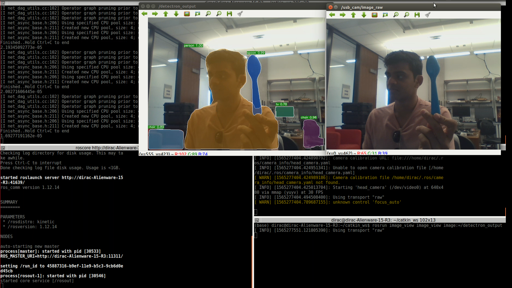
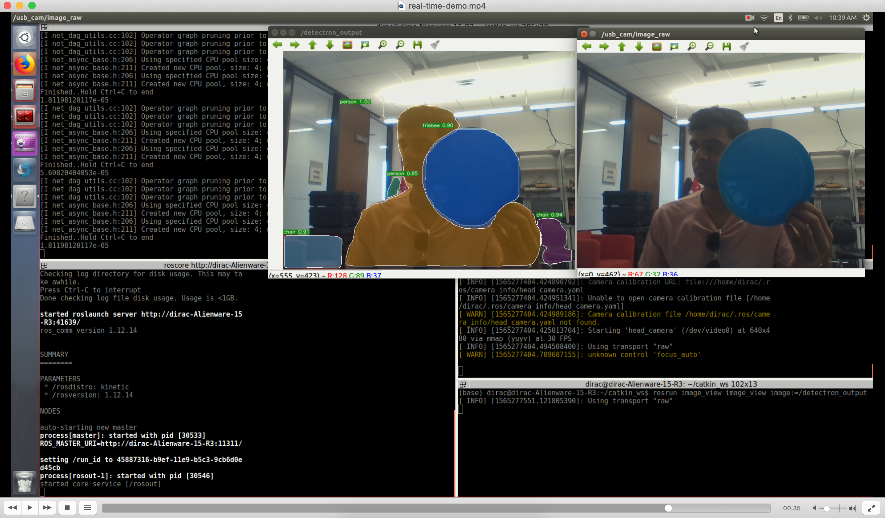

# ROS-based Detectron

Detectron is Facebook AI Research's software system that implements state-of-the-art object detection algorithms, including [Mask R-CNN](https://arxiv.org/abs/1703.06870). It is written in Python and powered by the [Caffe2](https://github.com/caffe2/caffe2) deep learning framework.

This update to the original Detectron code aims to communicate images with segmentation and object identification over a ROS node, aiding in computer vision projects in the field of Robotics. See [`INSTALL.md`](INSTALL.md) for installation instructions for Caffe2 and Detectron. Note that this project has been tested on ROS Kinetic with python 2. See below for ROS-specific instructions.

To see a video demo of this ROS package running from a laptop webcam, watch the youtube [video](https://youtu.be/iqWTFGoJn9I).

Currently, I am working on finetuning the ROS detectron with custom datasets. 

## Introduction

The goal of Detectron is to provide a high-quality, high-performance
codebase for object detection *research*. It is designed to be flexible in order
to support rapid implementation and evaluation of novel research. 

## Installation

Please find installation instructions for Caffe2 and Detectron in [`INSTALL.md`](INSTALL.md). For further installation questions and troubleshooting, visit the FAIR [github](https://github.com/facebookresearch/Detectron "Original Detectron").

# ROS instructions

Clone this fork into your ROS workspace in the /src folder (with your other packages). Follow the Detectron installation instructions to install Detectron successfully. To receive images from your webcam, use the the ROS [usb_cam](http://wiki.ros.org/usb_cam "ROS wiki") package. After cloning both these packages into your /src folder, run ```catkin_make``` in the root directory of your ROS workspace. 

Additionally, 
1. Run ```roscore``` to initialize ROS
2. Run ```roslaunch usb_cam usb_cam-test.launch``` to run the usb_cam node
3. Next, to run object inference, navigate to the Detectron package and run the command ```rosrun detectron infer_simple.py .```  This will cause images with object segmentation and labeling to be published on a /detectron_output topic through an Image ROS message type. 
4. To view published images, run ```rosrun image_view image_view image:=/detectron_output``` in a seperate terminal. 

# Some Image Examples 
<div align="center">
  
  <p>Inference on an iPhone</p>
  
  <p>Inference on a spoon</p>
  
  <p>Inference on a frisbee</p>
</div>

# ROS Troubleshooting
* Error message = "AttributeError: get_image instance has no attribute 'astype'" <br/>
Possible fix: ensure that the usb_cam package has been launched and is running

* Error message "usage: infer_simple.py...." <br/>
Possible fix: ensure that there is a period ``` . ``` at the end of the ``` rosrun detectron infer_simple.py``` command.

* Error with ```rosrun detectron infer_simple.py .```
Possible fix: navigate to your cloned Detectron package and run ```python2 tools/infer_simple.py .``` on the terminal


## License

Detectron is released under the [Apache 2.0 license](https://github.com/facebookresearch/detectron/blob/master/LICENSE). See the [NOTICE](https://github.com/facebookresearch/detectron/blob/master/NOTICE) file for additional details.

