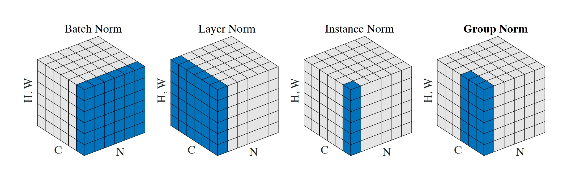

# Group Normalization for Mask R-CNN

<div align="center">
  
</div>

## Introduction

This file provides Mask R-CNN baseline results and models trained with [Group Normalization](https://arxiv.org/abs/1803.08494):

```
@article{GroupNorm2018,
  title={Group Normalization},
  author={Yuxin Wu and Kaiming He},
  journal={arXiv:1803.08494},
  year={2018}
}
```

**Note:** This code uses the GroupNorm op implemented in CUDA, included in the Caffe2 repo. When writing this document, Caffe2 is being merged into PyTorch, and the GroupNorm op is located [here](https://github.com/pytorch/pytorch/blob/master/caffe2/operators/group_norm_op.cu). Make sure your Caffe2 is up to date.

## Pretrained Models with GN

These models are trained in Caffe2 on the standard ImageNet-1k dataset, using GroupNorm with 32 groups (G=32).

- [R-50-GN.pkl](https://dl.fbaipublicfiles.com/detectron/ImageNetPretrained/47261647/R-50-GN.pkl): ResNet-50 with GN, 24.0\% top-1 error (center-crop).
- [R-101-GN.pkl](https://dl.fbaipublicfiles.com/detectron/ImageNetPretrained/47592356/R-101-GN.pkl): ResNet-101 with GN, 22.6\% top-1 error (center-crop).

## Results

### Baselines with BN

<table><tbody>
<!-- START E2E MASK RCNN BN TABLE -->
<!-- TABLE HEADER -->
<!-- Info: we use wrap text in <sup><sub></sub><sup> to make is small -->
<th valign="bottom"><sup><sub>&nbsp;&nbsp;&nbsp;&nbsp;&nbsp;&nbsp;&nbsp;&nbsp;&nbsp;case&nbsp;&nbsp;&nbsp;&nbsp;&nbsp;&nbsp;&nbsp;&nbsp;&nbsp;&nbsp;</sub></sup></th>
<th valign="bottom"><sup><sub>type</sub></sup></th>
<th valign="bottom"><sup><sub>lr<br/>schd</sub></sup></th>
<th valign="bottom"><sup><sub>im/<br/>gpu</sub></sup></th>
<th valign="bottom"><sup><sub>train<br/>mem<br/>(GB)</sub></sup></th>
<th valign="bottom"><sup><sub>train<br/>time<br/>(s/iter)</sub></sup></th>
<th valign="bottom"><sup><sub>train<br/>time<br/>total<br/>(hr)</sub></sup></th>
<th valign="bottom"><sup><sub>inference<br/>time<br/>(s/im)</sub></sup></th>
<th valign="bottom"><sup><sub>box<br/>AP</sub></sup></th>
<th valign="bottom"><sup><sub>mask<br/>AP</sub></sup></th>
<th valign="bottom"><sup><sub>model id</sub></sup></th>
<tr>
<td align="left"><sup><sub>R-50-FPN, BN*</sub></sup></td>
<td align="left"><sup><sub>Mask R-CNN</sub></sup></td>
<td align="left"><sup><sub>2x</sub></sup></td>
<td align="right"><sup><sub>2</sub></sup></td>
<td align="right"><sup><sub>8.6</sub></sup></td>
<td align="right"><sup><sub>0.897</sub></sup></td>
<td align="right"><sup><sub>44.9</sub></sup></td>
<td align="right"><sup><sub>0.099&nbsp;+&nbsp;0.018</sub></sup></td>
<td align="right"><sup><sub>38.6</sub></sup></td>
<td align="right"><sup><sub>34.5</sub></sup></td>
<td align="right"><sup><sub>35859007</sub></sup></td>
</tr>
<tr>
<td align="left"><sup><sub>R-101-FPN, BN*</sub></sup></td>
<td align="left"><sup><sub>Mask R-CNN</sub></sup></td>
<td align="left"><sup><sub>2x</sub></sup></td>
<td align="right"><sup><sub>2</sub></sup></td>
<td align="right"><sup><sub>10.2</sub></sup></td>
<td align="right"><sup><sub>0.993</sub></sup></td>
<td align="right"><sup><sub>49.7</sub></sup></td>
<td align="right"><sup><sub>0.126&nbsp;+&nbsp;0.017</sub></sup></td>
<td align="right"><sup><sub>40.9</sub></sup></td>
<td align="right"><sup><sub>36.4</sub></sup></td>
<td align="right"><sup><sub>35861858</sub></sup></td>
</tr>
<!-- END E2E MASK RCNN BN TABLE -->
</tbody></table>

**Notes:**

- This table is copied from [Detectron Model Zoo](https://github.com/facebookresearch/Detectron/blob/master/MODEL_ZOO.md#end-to-end-faster--mask-r-cnn-baselines).
- BN<sup>*</sup> means that BatchNorm (BN) is used for pre-training and is frozen and turned into a per-channel linear layer when fine-tuning. This is the default of Faster/Mask R-CNN and Detectron.

### Mask R-CNN with GN

#### Standard Mask R-CNN recipe
<table><tbody>
<!-- START E2E MASK RCNN GN TABLE -->
<!-- TABLE HEADER -->
<!-- Info: we use wrap text in <sup><sub></sub><sup> to make is small -->
<th valign="bottom"><sup><sub>&nbsp;&nbsp;&nbsp;&nbsp;&nbsp;&nbsp;&nbsp;&nbsp;&nbsp;case&nbsp;&nbsp;&nbsp;&nbsp;&nbsp;&nbsp;&nbsp;&nbsp;&nbsp;&nbsp;</sub></sup></th>
<th valign="bottom"><sup><sub>type</sub></sup></th>
<th valign="bottom"><sup><sub>lr<br/>schd</sub></sup></th>
<th valign="bottom"><sup><sub>im/<br/>gpu</sub></sup></th>
<th valign="bottom"><sup><sub>train<br/>mem<br/>(GB)</sub></sup></th>
<th valign="bottom"><sup><sub>train<br/>time<br/>(s/iter)</sub></sup></th>
<th valign="bottom"><sup><sub>train<br/>time<br/>total<br/>(hr)</sub></sup></th>
<th valign="bottom"><sup><sub>inference<br/>time<br/>(s/im)</sub></sup></th>
<th valign="bottom"><sup><sub>box<br/>AP</sub></sup></th>
<th valign="bottom"><sup><sub>mask<br/>AP</sub></sup></th>
<th valign="bottom"><sup><sub>model id</sub></sup></th>
<th valign="bottom"><sup><sub>download<br/>links</sub></sup></th>
<!-- TABLE BODY -->
<tr>
<td align="left"><sup><sub>R-50-FPN, GN</sub></sup></td>
<td align="left"><sup><sub>Mask R-CNN</sub></sup></td>
<td align="left"><sup><sub>2x</sub></sup></td>
<td align="right"><sup><sub>2</sub></sup></td>
<td align="right"><sup><sub>10.5</sub></sup></td>
<td align="right"><sup><sub>1.017</sub></sup></td>
<td align="right"><sup><sub>50.8</sub></sup></td>
<td align="right"><sup><sub>0.146&nbsp;+&nbsp;0.017</sub></sup></td>
<td align="right"><sup><sub>40.3</sub></sup></td>
<td align="right"><sup><sub>35.7</sub></sup></td>
<td align="right"><sup><sub>48616381</sub></sup></td>
<td align="left"><sup><sub>
  <a href="https://dl.fbaipublicfiles.com/detectron/GN/48616381/04_2018_gn_baselines/e2e_mask_rcnn_R-50-FPN_2x_gn_0416.13_23_38.bTlTI97Q/output/train/coco_2014_train%3Acoco_2014_valminusminival/generalized_rcnn/model_final.pkl">model</a>
  &nbsp;|&nbsp;
  <a href="https://dl.fbaipublicfiles.com/detectron/GN/48616381/04_2018_gn_baselines/e2e_mask_rcnn_R-50-FPN_2x_gn_0416.13_23_38.bTlTI97Q/output/test/coco_2014_minival/generalized_rcnn/bbox_coco_2014_minival_results.json">boxes</a>
  &nbsp;|&nbsp;
  <a href="https://dl.fbaipublicfiles.com/detectron/GN/48616381/04_2018_gn_baselines/e2e_mask_rcnn_R-50-FPN_2x_gn_0416.13_23_38.bTlTI97Q/output/test/coco_2014_minival/generalized_rcnn/segmentations_coco_2014_minival_results.json">masks</a></sub></sup></td>
</tr>
<tr>
<td align="left"><sup><sub>R-101-FPN, GN</sub></sup></td>
<td align="left"><sup><sub>Mask R-CNN</sub></sup></td>
<td align="left"><sup><sub>2x</sub></sup></td>
<td align="right"><sup><sub>2</sub></sup></td>
<td align="right"><sup><sub>12.4</sub></sup></td>
<td align="right"><sup><sub>1.151</sub></sup></td>
<td align="right"><sup><sub>57.5</sub></sup></td>
<td align="right"><sup><sub>0.180&nbsp;+&nbsp;0.015</sub></sup></td>
<td align="right"><sup><sub>41.8</sub></sup></td>
<td align="right"><sup><sub>36.8</sub></sup></td>
<td align="right"><sup><sub>48616724</sub></sup></td>
<td align="left"><sup><sub>
  <a href="https://dl.fbaipublicfiles.com/detectron/GN/48616724/04_2018_gn_baselines/e2e_mask_rcnn_R-101-FPN_2x_gn_0416.13_26_34.GLnri4GR/output/train/coco_2014_train%3Acoco_2014_valminusminival/generalized_rcnn/model_final.pkl">model</a>
  &nbsp;|&nbsp;
  <a href="https://dl.fbaipublicfiles.com/detectron/GN/48616724/04_2018_gn_baselines/e2e_mask_rcnn_R-101-FPN_2x_gn_0416.13_26_34.GLnri4GR/output/test/coco_2014_minival/generalized_rcnn/bbox_coco_2014_minival_results.json">boxes</a>
  &nbsp;|&nbsp;
  <a href="https://dl.fbaipublicfiles.com/detectron/GN/48616724/04_2018_gn_baselines/e2e_mask_rcnn_R-101-FPN_2x_gn_0416.13_26_34.GLnri4GR/output/test/coco_2014_minival/generalized_rcnn/segmentations_coco_2014_minival_results.json">masks</a></sub></sup></td>
</tr>
<!-- END E2E MASK RCNN GN TABLE -->
</tbody></table>

**Notes:**
- GN is applied on: (i) ResNet layers inherited from pre-training, (ii) the FPN-specific layers, (iii) the RoI bbox head, and (iv) the RoI mask head.
- These GN models use a 4conv+1fc RoI box head. The BN<sup>*</sup> counterpart with this head performs similarly with the default 2fc head: using this codebase, R-50-FPN BN<sup>\*</sup> with 4conv+1fc has 38.8/34.4 box/mask AP.
- 2x is the default schedule (180k) in Detectron.

#### Longer training schedule
<table><tbody>
<!-- START E2E MASK RCNN GN 3X TABLE -->
<!-- TABLE HEADER -->
<!-- Info: we use wrap text in <sup><sub></sub><sup> to make is small -->
<th valign="bottom"><sup><sub>&nbsp;&nbsp;&nbsp;&nbsp;&nbsp;&nbsp;&nbsp;&nbsp;&nbsp;case&nbsp;&nbsp;&nbsp;&nbsp;&nbsp;&nbsp;&nbsp;&nbsp;&nbsp;&nbsp;</sub></sup></th>
<th valign="bottom"><sup><sub>type</sub></sup></th>
<th valign="bottom"><sup><sub>lr<br/>schd</sub></sup></th>
<th valign="bottom"><sup><sub>im/<br/>gpu</sub></sup></th>
<th valign="bottom"><sup><sub>train<br/>mem<br/>(GB)</sub></sup></th>
<th valign="bottom"><sup><sub>train<br/>time<br/>(s/iter)</sub></sup></th>
<th valign="bottom"><sup><sub>train<br/>time<br/>total<br/>(hr)</sub></sup></th>
<th valign="bottom"><sup><sub>inference<br/>time<br/>(s/im)</sub></sup></th>
<th valign="bottom"><sup><sub>box<br/>AP</sub></sup></th>
<th valign="bottom"><sup><sub>mask<br/>AP</sub></sup></th>
<th valign="bottom"><sup><sub>model id</sub></sup></th>
<th valign="bottom"><sup><sub>download<br/>links</sub></sup></th>
<!-- TABLE BODY -->
<tr>
<td align="left"><sup><sub>R-50-FPN, GN</sub></sup></td>
<td align="left"><sup><sub>Mask R-CNN</sub></sup></td>
<td align="left"><sup><sub><b>3x</b></sub></sup></td>
<td align="right"><sup><sub>2</sub></sup></td>
<td align="right"><sup><sub>10.5</sub></sup></td>
<td align="right"><sup><sub>1.033</sub></sup></td>
<td align="right"><sup><sub>77.4</sub></sup></td>
<td align="right"><sup><sub>0.145&nbsp;+&nbsp;0.015</sub></sup></td>
<td align="right"><sup><sub>40.8</sub></sup></td>
<td align="right"><sup><sub>36.1</sub></sup></td>
<td align="right"><sup><sub>48734751</sub></sup></td>
<td align="left"><sup><sub>
  <a href="https://dl.fbaipublicfiles.com/detectron/GN/48734751/04_2018_gn_baselines/e2e_mask_rcnn_R-50-FPN_3x_gn_0417.09_54_59.nwCTtPVk/output/train/coco_2014_train%3Acoco_2014_valminusminival/generalized_rcnn/model_final.pkl">model</a>
  &nbsp;|&nbsp;
  <a href="https://dl.fbaipublicfiles.com/detectron/GN/48734751/04_2018_gn_baselines/e2e_mask_rcnn_R-50-FPN_3x_gn_0417.09_54_59.nwCTtPVk/output/test/coco_2014_minival/generalized_rcnn/bbox_coco_2014_minival_results.json">boxes</a>
  &nbsp;|&nbsp;
  <a href="https://dl.fbaipublicfiles.com/detectron/GN/48734751/04_2018_gn_baselines/e2e_mask_rcnn_R-50-FPN_3x_gn_0417.09_54_59.nwCTtPVk/output/test/coco_2014_minival/generalized_rcnn/segmentations_coco_2014_minival_results.json">masks</a></sub></sup></td>
</tr>
<tr>
<td align="left"><sup><sub>R-101-FPN, GN</sub></sup></td>
<td align="left"><sup><sub>Mask R-CNN</sub></sup></td>
<td align="left"><sup><sub><b>3x</b></sub></sup></td>
<td align="right"><sup><sub>2</sub></sup></td>
<td align="right"><sup><sub>12.4</sub></sup></td>
<td align="right"><sup><sub>1.171</sub></sup></td>
<td align="right"><sup><sub>87.9</sub></sup></td>
<td align="right"><sup><sub>0.180&nbsp;+&nbsp;0.014</sub></sup></td>
<td align="right"><sup><sub>42.3</sub></sup></td>
<td align="right"><sup><sub>37.2</sub></sup></td>
<td align="right"><sup><sub>48734779</sub></sup></td>
<td align="left"><sup><sub>
  <a href="https://dl.fbaipublicfiles.com/detectron/GN/48734779/04_2018_gn_baselines/e2e_mask_rcnn_R-101-FPN_3x_gn_0417.09_55_23.HMtcR8wg/output/train/coco_2014_train%3Acoco_2014_valminusminival/generalized_rcnn/model_final.pkl">model</a>
  &nbsp;|&nbsp;
  <a href="https://dl.fbaipublicfiles.com/detectron/GN/48734779/04_2018_gn_baselines/e2e_mask_rcnn_R-101-FPN_3x_gn_0417.09_55_23.HMtcR8wg/output/test/coco_2014_minival/generalized_rcnn/bbox_coco_2014_minival_results.json">boxes</a>
  &nbsp;|&nbsp;
  <a href="https://dl.fbaipublicfiles.com/detectron/GN/48734779/04_2018_gn_baselines/e2e_mask_rcnn_R-101-FPN_3x_gn_0417.09_55_23.HMtcR8wg/output/test/coco_2014_minival/generalized_rcnn/segmentations_coco_2014_minival_results.json">masks</a></sub></sup></td>
</tr>
<!-- END E2E MASK RCNN GN 3X TABLE -->
</tbody></table>

**Notes:**
- 3x is a longer schedule (270k). GN can improve further when using the longer schedule, but its BN<sup>*</sup> counterpart remains similar (R-50-FPN BN<sup>\*</sup>: 38.9/34.3) with the longer schedule.
- These models are **without** any scale augmentation that can further [improve results](https://github.com/facebookresearch/Detectron/blob/master/MODEL_ZOO.md#mask-r-cnn-with-bells--whistles).


### Explorations

#### Training Mask R-CNN from scratch

GN enables to train Mask R-CNN *from scratch* without ImageNet pre-training, despite the small batch size.

<table><tbody>
<!-- START E2E MASK RCNN GN SCRATCH TABLE -->
<!-- TABLE HEADER -->
<!-- Info: we use wrap text in <sup><sub></sub><sup> to make is small -->
<th valign="bottom"><sup><sub>&nbsp;&nbsp;&nbsp;&nbsp;&nbsp;&nbsp;&nbsp;&nbsp;&nbsp;case&nbsp;&nbsp;&nbsp;&nbsp;&nbsp;&nbsp;&nbsp;&nbsp;&nbsp;&nbsp;</sub></sup></th>
<th valign="bottom"><sup><sub>type</sub></sup></th>
<th valign="bottom"><sup><sub>lr<br/>schd</sub></sup></th>
<th valign="bottom"><sup><sub>im/<br/>gpu</sub></sup></th>
<th valign="bottom"><sup><sub>train<br/>mem<br/>(GB)</sub></sup></th>
<th valign="bottom"><sup><sub>train<br/>time<br/>(s/iter)</sub></sup></th>
<th valign="bottom"><sup><sub>train<br/>time<br/>total<br/>(hr)</sub></sup></th>
<th valign="bottom"><sup><sub>inference<br/>time<br/>(s/im)</sub></sup></th>
<th valign="bottom"><sup><sub>box<br/>AP</sub></sup></th>
<th valign="bottom"><sup><sub>mask<br/>AP</sub></sup></th>
<th valign="bottom"><sup><sub>model id</sub></sup></th>
<!-- TABLE BODY -->
<tr>
<td align="left"><sup><sub>R-50-FPN, GN, scratch</sub></sup></td>
<td align="left"><sup><sub>Mask R-CNN</sub></sup></td>
<td align="left"><sup><sub>3x</sub></sup></td>
<td align="right"><sup><sub>2</sub></sup></td>
<td align="right"><sup><sub>10.8</sub></sup></td>
<td align="right"><sup><sub>1.087</sub></sup></td>
<td align="right"><sup><sub>81.5</sub></sup></td>
<td align="right"><sup><sub>0.140&nbsp;+&nbsp;0.019</sub></sup></td>
<td align="right"><sup><sub>39.5</sub></sup></td>
<td align="right"><sup><sub>35.2</sub></sup></td>
<td align="right"><sup><sub>56421872</sub></sup></td>
</tr>
<tr>
<td align="left"><sup><sub>R-101-FPN, GN, scratch</sub></sup></td>
<td align="left"><sup><sub>Mask R-CNN</sub></sup></td>
<td align="left"><sup><sub>3x</sub></sup></td>
<td align="right"><sup><sub>2</sub></sup></td>
<td align="right"><sup><sub>12.7</sub></sup></td>
<td align="right"><sup><sub>1.243</sub></sup></td>
<td align="right"><sup><sub>93.2</sub></sup></td>
<td align="right"><sup><sub>0.177&nbsp;+&nbsp;0.019</sub></sup></td>
<td align="right"><sup><sub>41.0</sub></sup></td>
<td align="right"><sup><sub>36.4</sub></sup></td>
<td align="right"><sup><sub>56421911</sub></sup></td>
</tr>
<!-- END E2E MASK RCNN GN SCRATCH TABLE -->
</tbody></table>

**Notes:**
- To reproduce these results, see the config yaml files starting with ```scratch ```.
- These are results using ```freeze_at=0```. See this [commit](https://github.com/facebookresearch/Detectron/commit/f8ffc87ca442d8f6bd2b9aad11029b5db56d7260) about the related issue.

&nbsp;

<table><tbody>
<!-- START E2E MASK RCNN GN SCRATCH TABLE -->
<!-- TABLE HEADER -->
<!-- Info: we use wrap text in <sup><sub></sub><sup> to make is small -->
<!-- TABLE BODY -->
<tr>
<td align="left"><sup><sub><s>R-50-FPN, GN, scratch</s></sub></sup></td>
<td align="left"><sup><sub><s>Mask R-CNN</s></sub></sup></td>
<td align="left"><sup><sub><s>3x</s></sub></sup></td>
<td align="right"><sup><sub><s>2</s></sub></sup></td>
<td align="right"><sup><sub><s>10.5</s></sub></sup></td>
<td align="right"><sup><sub><s>0.990</s></sub></sup></td>
<td align="right"><sup><sub><s>74.3</s></sub></sup></td>
<td align="right"><sup><sub><s>0.146&nbsp;+&nbsp;0.020</s></sub></sup></td>
<td align="right"><sup><sub><s>36.2</s></sub></sup></td>
<td align="right"><sup><sub><s>32.5</s></sub></sup></td>
<td align="right"><sup><sub><s>49025460</s></sub></sup></td>
</tr>
<tr>
<td align="left"><sup><sub><s>R-101-FPN, GN, scratch</s></sub></sup></td>
<td align="left"><sup><sub><s>Mask R-CNN</s></sub></sup></td>
<td align="left"><sup><sub><s>3x</s></sub></sup></td>
<td align="right"><sup><sub><s>2</s></sub></sup></td>
<td align="right"><sup><sub><s>12.4</s></sub></sup></td>
<td align="right"><sup><sub><s>1.124</s></sub></sup></td>
<td align="right"><sup><sub><s>84.3</s></sub></sup></td>
<td align="right"><sup><sub><s>0.180&nbsp;+&nbsp;0.019</s></sub></sup></td>
<td align="right"><sup><sub><s>37.5</s></sub></sup></td>
<td align="right"><sup><sub><s>33.3</s></sub></sup></td>
<td align="right"><sup><sub><s>49024951</s></sub></sup></td>
</tr>
<!-- END E2E MASK RCNN GN SCRATCH TABLE -->
</tbody></table>

**Notes:**
- These are early results that followed the default training using ```freeze_at=2```. This means the layers of conv1 and res2 were simply random weights in the case of training from-scratch. See this [commit](https://github.com/facebookresearch/Detectron/commit/f8ffc87ca442d8f6bd2b9aad11029b5db56d7260) about the related issue.
